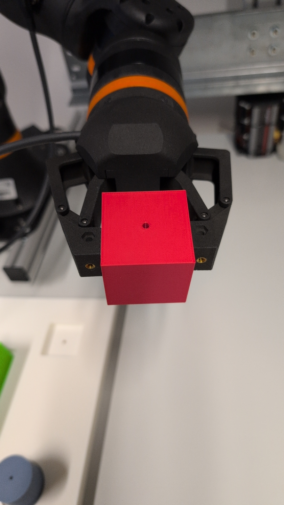

# Rebel Gripper

ROS2 package for the igus ReBeL articulated gripper with circular arc finger motion. Finger motion follows measured arcs, obtained from a SolidWorks motion-study trajectory data.


## Usage

### Standalone Visualization
```bash
ros2 launch rebel_gripper view_gripper.launch.py
```

### Integration with Robot in Klaus Workspace
```bash
ros2 launch kls_bringup kls.launch.py gripper_type:=rebel
```

## Files

- `urdf/rebel_gripper_macro.xacro`: Main gripper macro
- `urdf/rebel_gripper.urdf.xacro`: Wrapper for visualization
- `launch/view_gripper.launch.py`: Visualization launch file
- `meshes/`: STL mesh files

## Geometry of modeling the correct gripper movement

- **Finger radius**: $45.93$ mm (rotation center to fingertip)
- **Motor range**: $0^{\circ}$ (open) to $77.75^{\circ}$ (closed)
- **Rotation centers**: $\pm20$ mm (X), $62.81$ mm (Z) from gripper base

